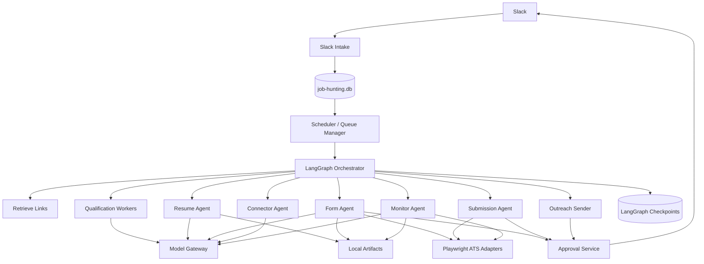
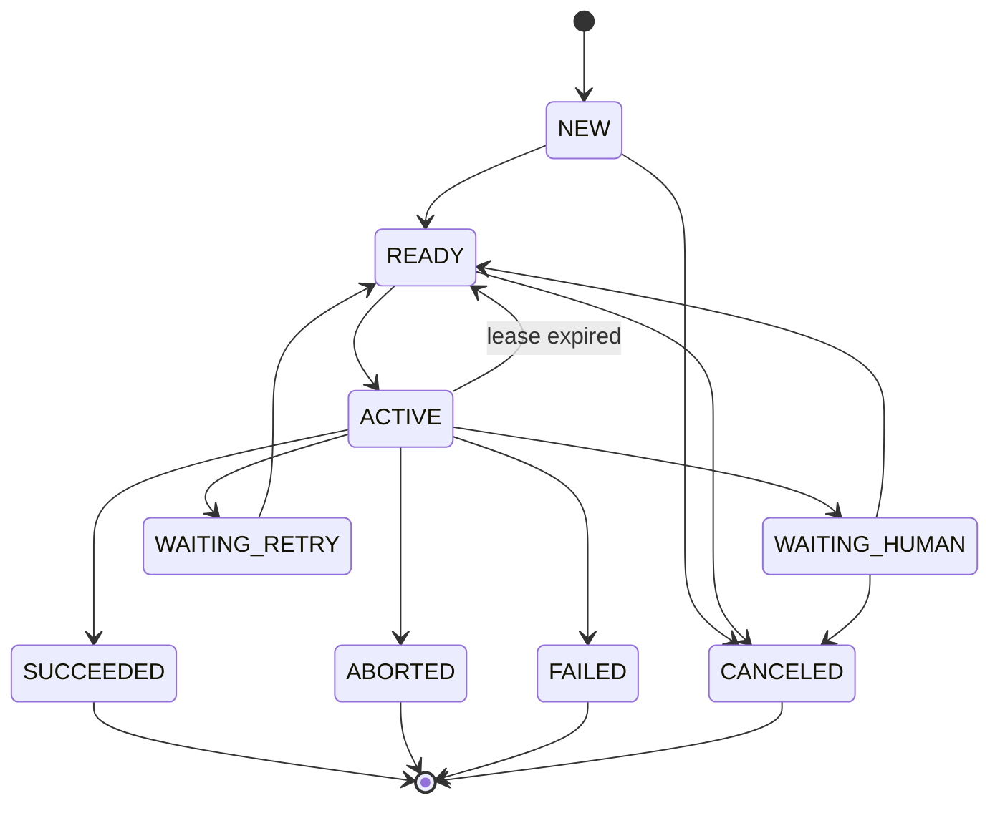
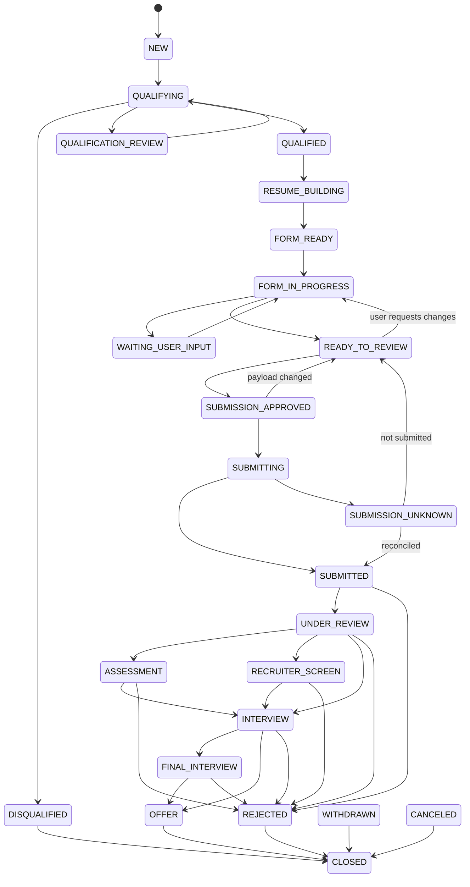

# Job Hunting Machine Architecture v2

**Document:** `docs/architecture-v2.md`
**Project:** Job Hunting Machine
**Architecture Version:** 2.0
**Status:** Proposed / Implementation Contract
**Date:** 2026-09-05
**Project Root:** `/Users/ping58972/Documents/job-hunting-machine`

**Amendment:** [A1 — Local LaTeX Document Pipeline](architecture-amendments/A1-latex-document-pipeline.md)
supersedes the original Google Docs/DOCX application-document design. The amended rules in this
document are authoritative for resume and cover-letter processing.

---

# 1. Purpose

Job Hunting Machine is a local-first, durable, multi-agent automation system for discovering, evaluating, preparing, submitting, tracking, and following up on job applications.

The system must optimize for:

1. correctness;
2. safety;
3. crash recovery;
4. resumability;
5. auditability;
6. low AI-token cost;
7. controlled parallelism;
8. strict human approval before important external actions;
9. truthful use of candidate information;
10. storage of generated project data only under the project root.

The machine is not a single autonomous AI agent.

It is a deterministic Python workflow system that delegates narrowly defined reasoning tasks to AI models.

---

# 2. Non-Negotiable Architecture Invariants

These rules override individual agent prompts.

## INV-001 — Project root

All workflow-generated files, artifacts, databases, logs, cached evidence, resumes, cover letters, screenshots, reports, browser session files, and checkpoints must stay under:

```text
/Users/ping58972/Documents/job-hunting-machine
```

A `PathGuard` must reject writes outside this root, including writes through symbolic links.

---

## INV-002 — SQLite is authoritative

The primary source of truth is:

```text
data/job-hunting.db
```

Google Sheets, dashboards, CSV files, or other views may later mirror data, but must never become authoritative state.

---

## INV-003 — Separate LangGraph checkpoint database

LangGraph persistence must use:

```text
data/langgraph-checkpoints.db
```

Do not put application-owned tables into the LangGraph checkpoint database.

Do not depend on LangGraph's internal checkpoint schema for application reporting.

LangGraph currently provides SQLite checkpointers and supports durable checkpoints, persistent `thread_id`s, and resume-after-failure behavior. citeturn995829search0turn995829search2

---

## INV-004 — Structured state is memory

Agents do not depend on conversation history as durable memory.

Every task reconstructs its context from:

```text
agent_queue
task_memory
application_pipeline
application_details
activity_log
artifacts
candidate_facts
form_answers
LangGraph checkpoint
```

---

## INV-005 — Every task has a unique Task ID

No work may execute without a persisted Task ID.

---

## INV-006 — Every application has a unique Application ID

All work after qualification is associated with exactly one Application ID.

---

## INV-007 — No invented candidate facts

AI agents may:

- select facts;
- rank facts;
- summarize facts;
- rephrase facts;
- reorganize facts.

AI agents may NOT invent:

- experience;
- skills;
- education;
- metrics;
- employment;
- dates;
- projects;
- certifications;
- work authorization information;
- demographic information;
- contact information.

Every candidate claim must be traceable to a verified source.

---

## INV-008 — Form answers come from canonical information

Application forms may only use:

```text
my_information_for_filling_form
candidate_facts
approved derived values
```

If an answer is unknown, the machine must ask through Slack instead of guessing.

---

## INV-009 — Final application submission always requires human approval

No agent, model, retry mechanism, scheduler, browser adapter, or recovery process can bypass this rule.

---

## INV-010 — Outreach always requires human approval

No recruiter email, employee email, recruiter message, HR message, or other external communication may be sent without approval.

---

## INV-011 — Approval binds to exact content

Approval applies only to the exact reviewed payload.

If any material application field, attachment, resume, cover letter, recipient, or message changes after approval:

```text
APPROVAL → INVALID
```

and a new approval is required.

---

## INV-012 — Irreversible actions use dedicated executors

The Form Agent cannot submit.

The Connector Agent cannot send outreach.

Only:

```text
Submission Agent
Outreach Sender
```

may execute those operations.

---

## INV-013 — External effects are idempotent

Every external side effect must have an `idempotency_key`.

A crash must never result in blindly repeating:

- Submit Application;
- Send Email;
- Create Account;
- Send Message.

---

## INV-014 — Dry-run is the default

Runtime modes:

```text
DRY_RUN
STAGING
LIVE
```

Default:

```text
DRY_RUN
```

---

## INV-015 — No CAPTCHA bypass

CAPTCHA or automation challenges transition the task to:

```text
WAITING_HUMAN
```

The system must never attempt CAPTCHA circumvention.

---

## INV-016 — No unauthorized LinkedIn browser automation

LinkedIn research or actions may use officially authorized mechanisms where available.

The system must not use Playwright to automatically scrape profiles, send connection requests, or send LinkedIn messages.

Drafting is allowed.

Human-assisted sending is allowed.

---

## INV-017 — Model use must be budgeted

Every AI request records:

```text
model
reasoning effort
input tokens
cached input
output tokens
estimated cost
task
application
prompt version
```

---

## INV-018 — Deterministic code before AI

If Python can reliably perform a task, do not spend AI tokens on it.

Examples:

```text
URL parsing
salary arithmetic
date comparison
duplicate detection
page counting
file hashing
state transitions
database updates
retry calculation
application ID creation
```

---

# 3. High-Level Architecture



---

# 4. Technology Stack

| Layer              | Technology                      |
| ------------------ | ------------------------------- |
| Language           | Python 3.12+                    |
| Package management | `uv`                          |
| Workflow engine    | LangGraph                       |
| Primary database   | SQLite                          |
| ORM                | SQLAlchemy 2.x                  |
| Migration          | Alembic                         |
| Validation         | Pydantic                        |
| Browser            | Playwright                      |
| HTTP               | `httpx`                       |
| HTML parsing       | `selectolax` or BeautifulSoup |
| Slack              | Slack Bolt + Socket Mode        |
| Email              | Gmail API                       |
| GitHub             | GitHub API                      |
| Resume template    | Local LaTeX (`.tex`)             |
| Document generation| Marker-scoped local LaTeX rendering |
| PDF generation     | `latexmk` / configured LaTeX compiler |
| PDF validation     | `pypdf`                       |
| Scheduler          | APScheduler initially           |
| CLI                | Typer                           |
| Optional local API | FastAPI                         |
| Testing            | pytest                          |
| AI API             | OpenAI Responses API            |

Structured Outputs using JSON Schema should be preferred over free-form model responses. citeturn916121search7

---

# 5. Project Directory Structure

```text
/Users/ping58972/Documents/job-hunting-machine/
│
├── AGENTS.md
├── README.md
├── pyproject.toml
├── uv.lock
├── .gitignore
├── .env.example
│
├── config/
│   ├── runtime.yaml
│   ├── models.yaml
│   ├── workers.yaml
│   ├── ats-adapters.yaml
│   └── logging.yaml
│
├── docs/
│   ├── architecture-v2.md
│   ├── database.md
│   ├── state-machines.md
│   ├── safety.md
│   ├── operations.md
│   └── phase-reports/
│
├── prompts/
│   ├── qualification/
│   ├── resume/
│   ├── cover-letter/
│   ├── form/
│   ├── connector/
│   └── monitor/
│
├── data/
│   ├── job-hunting.db
│   ├── langgraph-checkpoints.db
│   ├── latex-build/
│   ├── cache/
│   └── browser-sessions/
│
├── source/
│   ├── NDanddank_resume.tex
│   ├── NDanddank_cover_letter.tex
│   ├── AcademicRecord2022May_MSU_s.pdf
│   └── other-approved-source-files/
│
├── resumes/
│   ├── NDanddank_resume_<Company>_<Position>_<Date>.tex
│   ├── NDanddank_resume.pdf
├── cover-letters/
├── applications/
├── screenshots/
├── evidence/
│   ├── jobs/
│   ├── applications/
│   ├── emails/
│   └── companies/
│
├── reports/
├── logs/
├── backups/
│
├── src/
│   └── job_hunting_machine/
│       ├── __init__.py
│       ├── cli.py
│       │
│       ├── orchestration/
│       │   ├── graph.py
│       │   ├── scheduler.py
│       │   ├── workers.py
│       │   ├── leasing.py
│       │   ├── recovery.py
│       │   └── state.py
│       │
│       ├── agents/
│       │   ├── retrieve_links.py
│       │   ├── qualification.py
│       │   ├── resume.py
│       │   ├── cover_letter.py
│       │   ├── form.py
│       │   ├── submission.py
│       │   ├── connector.py
│       │   ├── outreach_sender.py
│       │   └── monitor.py
│       │
│       ├── database/
│       │   ├── engine.py
│       │   ├── models.py
│       │   ├── repositories/
│       │   └── migrations/
│       │
│       ├── models/
│       │   ├── gateway.py
│       │   ├── router.py
│       │   ├── budgets.py
│       │   ├── schemas.py
│       │   └── pricing.py
│       │
│       ├── browser/
│       │   ├── manager.py
│       │   ├── detector.py
│       │   ├── safety.py
│       │   └── adapters/
│       │       ├── base.py
│       │       ├── greenhouse.py
│       │       ├── lever.py
│       │       ├── ashby.py
│       │       ├── workday.py
│       │       ├── icims.py
│       │       ├── smartrecruiters.py
│       │       └── generic.py
│       │
│       ├── integrations/
│       │   ├── slack/
│       │   ├── gmail/
│       │   ├── github/
│       │   └── web/
│       │
│       ├── approvals/
│       │   ├── service.py
│       │   ├── hashing.py
│       │   └── policy.py
│       │
│       ├── artifacts/
│       │   ├── resume.py
│       │   ├── cover_letter.py
│       │   ├── pdf.py
│       │   └── hashing.py
│       │
│       ├── policies/
│       │   ├── qualification.py
│       │   ├── salary.py
│       │   └── work_authorization.py
│       │
│       ├── security/
│       │   ├── paths.py
│       │   ├── secrets.py
│       │   └── redaction.py
│       │
│       └── observability/
│           ├── logging.py
│           ├── usage.py
│           └── audit.py
│
├── tests/
│   ├── unit/
│   ├── integration/
│   ├── browser/
│   ├── fault_injection/
│   ├── evals/
│   └── fixtures/
│
└── scripts/
```

---

# 6. File-System Safety

Every write operation must call a single shared `PathGuard`.

Conceptual rule:

```python
ROOT = Path("/Users/ping58972/Documents/job-hunting-machine").resolve()
```

A target is allowed only when its resolved path remains inside `ROOT`.

The implementation must also defend against symbolic links resolving outside the project root.

Sensitive paths:

```text
data/browser-sessions/
data/*.db
```

should have restrictive local permissions.

Browser authentication state may contain credentials such as cookies and tokens, so it must never be committed to Git. Playwright explicitly warns that stored browser state can contain sensitive authentication material. citeturn916121search0

---

# 7. Secret Management

Passwords and API keys must NOT be stored in:

```text
activity_log
task_memory
browser screenshots
Git
plain-text configuration
```

Preferred:

```text
environment variables
macOS Keychain
```

Generated browser session state remains local in:

```text
data/browser-sessions/
```

and is ignored by Git.

Job-site passwords should be generated using Python's cryptographic `secrets` module and stored through the secret-management abstraction rather than the application database.

---

# 8. Identifier Standard

Use ULIDs.

Benefits:

- globally unique;
- sortable by creation time;
- safe for concurrent workers;
- do not require a central counter.

## 8.1 Task ID

Format:

```text
TASK_<26-character-ULID>
```

Example:

```text
TASK_01K4Y9DKQF0S1NHV0A84NJBYPM
```

Regex:

```regex
^TASK_[0-9A-HJKMNP-TV-Z]{26}$
```

---

## 8.2 Application ID

```text
APP_<ULID>
```

Example:

```text
APP_01K4Y9DM28A06YF81V66VQPDHJ
```

---

## 8.3 Job ID

```text
JOB_<ULID>
```

---

## 8.4 Approval ID

```text
APR_<ULID>
```

---

## 8.5 Artifact ID

```text
ART_<ULID>
```

---

## 8.6 Contact ID

```text
CNT_<ULID>
```

---

## 8.7 Event ID

```text
EVT_<ULID>
```

---

## 8.8 ID generation rule

IDs must be created once at the write boundary and persisted.

Never generate a new identifier during LangGraph replay for an object that already exists.

---

# 9. SQLite Configuration

At database initialization:

```sql
PRAGMA foreign_keys = ON;
PRAGMA journal_mode = WAL;
PRAGMA synchronous = NORMAL;
PRAGMA busy_timeout = 5000;
```

Application timestamps are UTC ISO-8601 strings.

Example:

```text
2026-09-05T08:23:31.123Z
```

Alembic owns schema migrations.

---

# 10. Core SQLite Schema

## 10.1 Qualification rule sets

```sql
CREATE TABLE qualification_rule_sets (
    rule_set_id TEXT PRIMARY KEY,
    name TEXT NOT NULL,
    version INTEGER NOT NULL,
    description TEXT,
    enabled INTEGER NOT NULL DEFAULT 1
        CHECK (enabled IN (0, 1)),
    effective_from TEXT,
    effective_until TEXT,
    created_at TEXT NOT NULL,
    updated_at TEXT NOT NULL,
    UNIQUE(name, version)
);
```

---

## 10.2 Qualification rules

```sql
CREATE TABLE qualification_rules (
    rule_id TEXT PRIMARY KEY,
    rule_set_id TEXT NOT NULL,
    rule_key TEXT NOT NULL,
    description TEXT NOT NULL,

    applies_to TEXT NOT NULL
        CHECK (
            applies_to IN (
                'ALL',
                'INTERNSHIP',
                'NEW_GRAD',
                'EARLY_CAREER',
                'FULL_TIME'
            )
        ),

    evaluator_kind TEXT NOT NULL
        CHECK (
            evaluator_kind IN (
                'DETERMINISTIC',
                'SEMANTIC',
                'RESEARCH'
            )
        ),

    severity TEXT NOT NULL
        CHECK (severity IN ('HARD', 'SOFT')),

    operator TEXT,
    expected_value_json TEXT
        CHECK (
            expected_value_json IS NULL
            OR json_valid(expected_value_json)
        ),

    priority INTEGER NOT NULL DEFAULT 100,

    enabled INTEGER NOT NULL DEFAULT 1
        CHECK (enabled IN (0, 1)),

    created_at TEXT NOT NULL,
    updated_at TEXT NOT NULL,

    FOREIGN KEY(rule_set_id)
        REFERENCES qualification_rule_sets(rule_set_id),

    UNIQUE(rule_set_id, rule_key)
);
```

---

## 10.3 Salary location rules

```sql
CREATE TABLE salary_location_rules (
    salary_rule_id TEXT PRIMARY KEY,

    country_code TEXT NOT NULL,
    state_region TEXT,
    city TEXT,

    cost_tier TEXT NOT NULL
        CHECK (
            cost_tier IN (
                'STANDARD',
                'HIGH',
                'VERY_HIGH'
            )
        ),

    internship_min_hourly_usd REAL NOT NULL,

    enabled INTEGER NOT NULL DEFAULT 1
        CHECK (enabled IN (0, 1)),

    notes TEXT,

    created_at TEXT NOT NULL,
    updated_at TEXT NOT NULL
);
```

Default fallback:

```text
USA internship minimum = $20/hour
```

Seed higher-cost cities such as:

```text
San Francisco
New York City
```

at:

```text
$35/hour
```

The database policy may be edited later without modifying agent code.

---

# 11. Qualification Policy v2

## 11.1 Internship

Required:

```text
work period intersects Jan 2027 – Aug 2027
USA only
paid
CPT-compatible
relevant field
salary meets location threshold
application still open
```

---

## 11.2 New Graduate / Early Career

Start timing should be compatible with graduation after:

```text
May 2027
```

Allowed countries:

```text
United States
Canada
United Kingdom / England
Australia
New Zealand
Singapore
Hong Kong
China
South Korea
Japan
```

---

## 11.3 Relevant occupational areas

Examples:

```text
Software Engineering
Machine Learning
Artificial Intelligence
Data / Data Engineering / Data Science
Robotics
Computer Vision
NLP
IT / Computing
related technical areas
```

---

## 11.4 Experience requirement

If minimum professional experience required is:

```text
>= 5 years
```

then fail the current hard rule.

Examples:

```text
2+ years       → PASS
3–5 years      → PASS
4+ years       → PASS
5+ years       → FAIL
7 years        → FAIL
```

If experience wording cannot be normalized:

```text
UNKNOWN
```

and escalate.

---

## 11.5 U.S. full-time work authorization

The system must distinguish:

```text
OPT_COMPATIBLE
SPONSORSHIP_SUPPORTED
SPONSORSHIP_NOT_SUPPORTED
UNKNOWN
```

Absence of sponsorship language is NOT evidence of sponsorship.

Absence of sponsorship language is also NOT automatically evidence of non-sponsorship.

Unknown cases should use research and/or human review.

---

# 12. Job Intake Table

This table implements the logical:

> Check Job Position Quality

```sql
CREATE TABLE check_job_position_quality (
    job_id TEXT PRIMARY KEY,

    original_url TEXT NOT NULL,
    canonical_url TEXT NOT NULL,

    url_sha256 TEXT NOT NULL,

    source_type TEXT NOT NULL,
    source_reference TEXT,

    company_name TEXT,
    job_title TEXT,

    employment_type TEXT,
    location_text TEXT,
    country_code TEXT,
    city TEXT,
    state_region TEXT,

    salary_min REAL,
    salary_max REAL,
    salary_currency TEXT,
    salary_period TEXT,

    required_experience_min REAL,
    required_experience_max REAL,

    posting_date TEXT,
    application_deadline TEXT,

    internship_start TEXT,
    internship_end TEXT,

    work_authorization_text TEXT,

    description_text_path TEXT,
    raw_snapshot_path TEXT,
    content_sha256 TEXT,

    qualification_status TEXT NOT NULL
        CHECK (
            qualification_status IN (
                'NEW',
                'ACTIVE',
                'PASSED',
                'ABORTED',
                'NEEDS_REVIEW',
                'ERROR'
            )
        ),

    qualification_confidence REAL,

    failed_rules_json TEXT
        CHECK (
            failed_rules_json IS NULL
            OR json_valid(failed_rules_json)
        ),

    unknown_rules_json TEXT
        CHECK (
            unknown_rules_json IS NULL
            OR json_valid(unknown_rules_json)
        ),

    notes TEXT,

    first_seen_at TEXT NOT NULL,
    last_checked_at TEXT,
    updated_at TEXT NOT NULL,

    UNIQUE(canonical_url)
);
```

---

# 13. Application Pipeline

```sql
CREATE TABLE application_pipeline (
    application_id TEXT PRIMARY KEY,
    job_id TEXT NOT NULL UNIQUE,

    pipeline_stage TEXT NOT NULL
        CHECK (
            pipeline_stage IN (
                'QUALIFICATION',
                'RESUME',
                'FORM',
                'REVIEW',
                'SUBMISSION',
                'POST_SUBMISSION',
                'MONITORING',
                'CLOSED'
            )
        ),

    application_status TEXT NOT NULL,

    priority INTEGER NOT NULL DEFAULT 100,

    current_task_id TEXT,

    created_at TEXT NOT NULL,
    updated_at TEXT NOT NULL,
    closed_at TEXT,

    FOREIGN KEY(job_id)
        REFERENCES check_job_position_quality(job_id)
);
```

---

# 14. Application Details

```sql
CREATE TABLE application_details (
    application_id TEXT PRIMARY KEY,

    company_name TEXT NOT NULL,
    job_title TEXT NOT NULL,

    job_url TEXT NOT NULL,
    application_url TEXT,

    ats_type TEXT,

    portal_account_identifier TEXT,

    location_text TEXT,
    employment_type TEXT,

    application_status TEXT NOT NULL,

    submitted_at TEXT,
    last_status_checked_at TEXT,

    resume_artifact_id TEXT,
    cover_letter_artifact_id TEXT,

    referral_contact_status TEXT NOT NULL DEFAULT 'NOT_STARTED',

    notes TEXT,

    created_at TEXT NOT NULL,
    updated_at TEXT NOT NULL,

    FOREIGN KEY(application_id)
        REFERENCES application_pipeline(application_id)
        ON DELETE CASCADE
);
```

---

# 15. Agent Queue

This is the authoritative work queue.

```sql
CREATE TABLE agent_queue (
    task_id TEXT PRIMARY KEY,

    application_id TEXT,
    job_id TEXT,

    parent_task_id TEXT,

    task_type TEXT NOT NULL,

    task_status TEXT NOT NULL
        CHECK (
            task_status IN (
                'NEW',
                'READY',
                'ACTIVE',
                'WAITING_HUMAN',
                'WAITING_RETRY',
                'SUCCEEDED',
                'ABORTED',
                'FAILED',
                'CANCELED'
            )
        ),

    priority INTEGER NOT NULL DEFAULT 100,

    payload_json TEXT
        CHECK (
            payload_json IS NULL
            OR json_valid(payload_json)
        ),

    dedupe_key TEXT,

    checkpoint_key TEXT,

    worker_id TEXT,
    lease_expires_at TEXT,
    heartbeat_at TEXT,

    attempt_count INTEGER NOT NULL DEFAULT 0,
    max_attempts INTEGER NOT NULL DEFAULT 3,

    next_run_at TEXT,

    last_error_code TEXT,
    last_error_message TEXT,

    version INTEGER NOT NULL DEFAULT 1,

    created_at TEXT NOT NULL,
    updated_at TEXT NOT NULL,
    started_at TEXT,
    completed_at TEXT,

    FOREIGN KEY(application_id)
        REFERENCES application_pipeline(application_id),

    FOREIGN KEY(job_id)
        REFERENCES check_job_position_quality(job_id),

    FOREIGN KEY(parent_task_id)
        REFERENCES agent_queue(task_id),

    UNIQUE(dedupe_key)
);
```

Indexes:

```sql
CREATE INDEX idx_agent_queue_claim
ON agent_queue(
    task_status,
    next_run_at,
    priority,
    created_at
);

CREATE INDEX idx_agent_queue_application
ON agent_queue(application_id);
```

---

# 16. Generic Task State Machine



---

# 17. Worker Leasing

A worker must atomically claim one eligible task.

Conceptually:

```text
READY
+
next_run_at <= now
+
no active lease
```

becomes:

```text
ACTIVE
worker_id = ...
lease_expires_at = ...
heartbeat_at = ...
```

Recommended initial lease:

```text
10 minutes
```

Recommended heartbeat:

```text
60 seconds
```

The worker periodically extends its lease.

If the laptop dies:

```text
lease expires
→ recovery service changes stale ACTIVE task to READY
→ another worker continues
```

No worker may rely solely on an in-memory lock.

---

# 18. Task Memory

```sql
CREATE TABLE task_memory (
    task_id TEXT PRIMARY KEY,

    memory_version INTEGER NOT NULL DEFAULT 1,

    summary TEXT,

    state_json TEXT NOT NULL
        CHECK (json_valid(state_json)),

    last_checkpoint TEXT,

    last_agent TEXT,

    updated_at TEXT NOT NULL,

    FOREIGN KEY(task_id)
        REFERENCES agent_queue(task_id)
        ON DELETE CASCADE
);
```

Task memory contains concise durable working context.

It should NOT duplicate entire job descriptions or giant model conversations.

Large evidence stays in files and is referenced by path/hash.

---

# 19. Activity Log

Append-only audit history.

```sql
CREATE TABLE activity_log (
    event_id TEXT PRIMARY KEY,

    task_id TEXT,
    application_id TEXT,
    job_id TEXT,

    actor_type TEXT NOT NULL
        CHECK (
            actor_type IN (
                'SYSTEM',
                'AGENT',
                'USER',
                'MODEL',
                'SLACK',
                'BROWSER'
            )
        ),

    actor_name TEXT,

    event_type TEXT NOT NULL,

    old_state TEXT,
    new_state TEXT,

    message TEXT,

    metadata_json TEXT
        CHECK (
            metadata_json IS NULL
            OR json_valid(metadata_json)
        ),

    created_at TEXT NOT NULL,

    FOREIGN KEY(task_id)
        REFERENCES agent_queue(task_id),

    FOREIGN KEY(application_id)
        REFERENCES application_pipeline(application_id),

    FOREIGN KEY(job_id)
        REFERENCES check_job_position_quality(job_id)
);
```

Application code must never UPDATE or DELETE historical activity rows during normal operation.

---

# 20. Slack Events

```sql
CREATE TABLE slack_events (
    slack_event_id TEXT PRIMARY KEY,

    event_type TEXT NOT NULL,

    channel_id TEXT,
    message_ts TEXT,
    thread_ts TEXT,
    user_id TEXT,

    payload_sha256 TEXT NOT NULL,

    processing_status TEXT NOT NULL,

    received_at TEXT NOT NULL,
    processed_at TEXT,

    UNIQUE(channel_id, message_ts, event_type)
);
```

This prevents processing duplicate Slack deliveries.

---

# 21. Canonical Form Information

Logical table:

> My Information For Filling Form

```sql
CREATE TABLE my_information_for_filling_form (
    info_key TEXT PRIMARY KEY,

    category TEXT NOT NULL,

    value_json TEXT NOT NULL
        CHECK (json_valid(value_json)),

    value_type TEXT NOT NULL,

    sensitivity TEXT NOT NULL
        CHECK (
            sensitivity IN (
                'NORMAL',
                'PERSONAL',
                'SENSITIVE'
            )
        ),

    auto_fill_policy TEXT NOT NULL
        CHECK (
            auto_fill_policy IN (
                'ALLOW',
                'ASK_IF_AMBIGUOUS',
                'MANUAL_ONLY'
            )
        ),

    source TEXT NOT NULL,

    verified INTEGER NOT NULL DEFAULT 0
        CHECK (verified IN (0, 1)),

    notes TEXT,

    created_at TEXT NOT NULL,
    updated_at TEXT NOT NULL
);
```

Example keys:

```text
identity.legal_first_name
identity.legal_last_name
contact.email
contact.phone
address.current
education.umass.degree
education.umass.graduation_date
authorization.usa.current_status
authorization.usa.future_sponsorship_required
employment.current_company
```

Sensitive voluntary demographic questions should default to:

```text
MANUAL_ONLY
```

unless the user explicitly chooses otherwise.

---

# 22. Candidate Facts

```sql
CREATE TABLE candidate_facts (
    fact_id TEXT PRIMARY KEY,

    fact_type TEXT NOT NULL,
    fact_key TEXT NOT NULL,

    value_json TEXT NOT NULL
        CHECK (json_valid(value_json)),

    source_type TEXT NOT NULL,
    source_reference TEXT NOT NULL,

    evidence_path TEXT,

    verification_status TEXT NOT NULL
        CHECK (
            verification_status IN (
                'VERIFIED',
                'UNVERIFIED',
                'REJECTED'
            )
        ),

    created_at TEXT NOT NULL,
    updated_at TEXT NOT NULL,

    UNIQUE(fact_key, source_reference)
);
```

Resume generation may use only:

```text
verification_status = VERIFIED
```

unless human review explicitly approves otherwise.

---

# 23. Project Catalog

```sql
CREATE TABLE project_catalog (
    project_id TEXT PRIMARY KEY,

    name TEXT NOT NULL,

    github_url TEXT,
    repository_name TEXT,

    description TEXT,

    languages_json TEXT
        CHECK (
            languages_json IS NULL
            OR json_valid(languages_json)
        ),

    frameworks_json TEXT
        CHECK (
            frameworks_json IS NULL
            OR json_valid(frameworks_json)
        ),

    topics_json TEXT
        CHECK (
            topics_json IS NULL
            OR json_valid(topics_json)
        ),

    verified_facts_json TEXT
        CHECK (
            verified_facts_json IS NULL
            OR json_valid(verified_facts_json)
        ),

    evidence_path TEXT,

    source_commit_sha TEXT,

    last_scanned_at TEXT,

    created_at TEXT NOT NULL,
    updated_at TEXT NOT NULL
);
```

---

# 24. Skill Catalog

```sql
CREATE TABLE skill_catalog (
    skill_id TEXT PRIMARY KEY,

    canonical_name TEXT NOT NULL UNIQUE,

    category TEXT NOT NULL,

    evidence_json TEXT NOT NULL
        CHECK (json_valid(evidence_json)),

    verification_status TEXT NOT NULL,

    last_verified_at TEXT,

    created_at TEXT NOT NULL,
    updated_at TEXT NOT NULL
);
```

---

# 25. Artifacts

```sql
CREATE TABLE artifacts (
    artifact_id TEXT PRIMARY KEY,

    application_id TEXT,

    task_id TEXT,

    artifact_type TEXT NOT NULL
        CHECK (
            artifact_type IN (
                'RESUME_DOCX',
                'RESUME_TEX',
                'RESUME_PDF',
                'COVER_LETTER_DOCX',
                'COVER_LETTER_TEX',
                'COVER_LETTER_PDF',
                'TRANSCRIPT',
                'SCREENSHOT',
                'JOB_SNAPSHOT',
                'OTHER'
            )
        ),

    path TEXT NOT NULL,

    sha256 TEXT NOT NULL,

    mime_type TEXT,

    version INTEGER NOT NULL DEFAULT 1,

    approved_for_submission INTEGER NOT NULL DEFAULT 0
        CHECK (approved_for_submission IN (0, 1)),

    created_at TEXT NOT NULL,

    FOREIGN KEY(application_id)
        REFERENCES application_pipeline(application_id),

    FOREIGN KEY(task_id)
        REFERENCES agent_queue(task_id)
);
```

Every application artifact must have a SHA-256 hash.

---

# 26. Form Answers

```sql
CREATE TABLE form_answers (
    answer_id TEXT PRIMARY KEY,

    application_id TEXT NOT NULL,

    page_key TEXT,
    field_key TEXT NOT NULL,

    question_text TEXT NOT NULL,

    answer_json TEXT
        CHECK (
            answer_json IS NULL
            OR json_valid(answer_json)
        ),

    answer_source_type TEXT
        CHECK (
            answer_source_type IN (
                'CANONICAL_INFO',
                'CANDIDATE_FACT',
                'USER',
                'DERIVED',
                'FILE'
            )
        ),

    answer_source_reference TEXT,

    confidence REAL,

    answer_status TEXT NOT NULL
        CHECK (
            answer_status IN (
                'EMPTY',
                'FILLED',
                'NEEDS_USER',
                'VALIDATED'
            )
        ),

    last_verified_at TEXT,

    created_at TEXT NOT NULL,
    updated_at TEXT NOT NULL,

    FOREIGN KEY(application_id)
        REFERENCES application_pipeline(application_id),

    UNIQUE(application_id, page_key, field_key)
);
```

---

# 27. Browser Sessions

```sql
CREATE TABLE browser_sessions (
    browser_session_id TEXT PRIMARY KEY,

    application_id TEXT NOT NULL,

    ats_type TEXT,

    storage_state_path TEXT,

    current_url TEXT,

    current_page_key TEXT,

    session_status TEXT NOT NULL,

    expires_at TEXT,

    last_checkpoint_at TEXT,

    created_at TEXT NOT NULL,
    updated_at TEXT NOT NULL,

    FOREIGN KEY(application_id)
        REFERENCES application_pipeline(application_id)
);
```

Playwright can persist authentication state and reuse it in later browser contexts. citeturn916121search0turn916121search6

---

# 28. Approvals

```sql
CREATE TABLE approvals (
    approval_id TEXT PRIMARY KEY,

    application_id TEXT,
    task_id TEXT,

    approval_type TEXT NOT NULL
        CHECK (
            approval_type IN (
                'PREPARE_APPLICATION',
                'SUBMIT_APPLICATION',
                'SEND_EMAIL',
                'SEND_EXTERNAL_MESSAGE'
            )
        ),

    approval_status TEXT NOT NULL
        CHECK (
            approval_status IN (
                'PENDING',
                'APPROVED',
                'REJECTED',
                'EXPIRED',
                'REVOKED',
                'CONSUMED'
            )
        ),

    payload_path TEXT NOT NULL,
    payload_sha256 TEXT NOT NULL,

    requested_via TEXT NOT NULL DEFAULT 'SLACK',

    slack_channel_id TEXT,
    slack_message_ts TEXT,

    decided_by_slack_user_id TEXT,

    requested_at TEXT NOT NULL,
    decided_at TEXT,

    valid_until TEXT,
    consumed_at TEXT,

    rejection_reason TEXT,

    FOREIGN KEY(application_id)
        REFERENCES application_pipeline(application_id),

    FOREIGN KEY(task_id)
        REFERENCES agent_queue(task_id)
);
```

---

# 29. External Action Ledger

```sql
CREATE TABLE external_actions (
    external_action_id TEXT PRIMARY KEY,

    application_id TEXT,
    task_id TEXT,
    approval_id TEXT,

    action_type TEXT NOT NULL,

    idempotency_key TEXT NOT NULL UNIQUE,

    request_sha256 TEXT NOT NULL,

    action_status TEXT NOT NULL
        CHECK (
            action_status IN (
                'PLANNED',
                'EXECUTING',
                'SUCCEEDED',
                'FAILED',
                'UNKNOWN_RESULT'
            )
        ),

    external_reference TEXT,

    result_json TEXT
        CHECK (
            result_json IS NULL
            OR json_valid(result_json)
        ),

    created_at TEXT NOT NULL,
    updated_at TEXT NOT NULL,

    FOREIGN KEY(application_id)
        REFERENCES application_pipeline(application_id),

    FOREIGN KEY(task_id)
        REFERENCES agent_queue(task_id),

    FOREIGN KEY(approval_id)
        REFERENCES approvals(approval_id)
);
```

`UNKNOWN_RESULT` is extremely important.

Example:

```text
click Submit
→ network disappears
→ browser does not know whether application succeeded
```

The action becomes:

```text
UNKNOWN_RESULT
```

The machine must reconcile portal/email status before attempting anything again.

---

# 30. Contacts

```sql
CREATE TABLE contacts (
    contact_id TEXT PRIMARY KEY,

    application_id TEXT NOT NULL,

    company_name TEXT NOT NULL,

    full_name TEXT,

    title TEXT,

    contact_type TEXT
        CHECK (
            contact_type IN (
                'RECRUITER',
                'HR',
                'HIRING_MANAGER',
                'EMPLOYEE',
                'OTHER'
            )
        ),

    email TEXT,
    linkedin_url TEXT,

    source_url TEXT,

    confidence REAL,

    verified INTEGER NOT NULL DEFAULT 0
        CHECK (verified IN (0, 1)),

    created_at TEXT NOT NULL,
    updated_at TEXT NOT NULL,

    FOREIGN KEY(application_id)
        REFERENCES application_pipeline(application_id)
);
```

---

# 31. Outreach Drafts

```sql
CREATE TABLE outreach_drafts (
    outreach_id TEXT PRIMARY KEY,

    application_id TEXT NOT NULL,
    contact_id TEXT NOT NULL,

    channel TEXT NOT NULL
        CHECK (
            channel IN (
                'EMAIL',
                'LINKEDIN_MANUAL'
            )
        ),

    subject TEXT,
    body TEXT NOT NULL,

    payload_sha256 TEXT NOT NULL,

    draft_status TEXT NOT NULL
        CHECK (
            draft_status IN (
                'DRAFT',
                'READY_FOR_REVIEW',
                'APPROVED',
                'SENT',
                'REJECTED'
            )
        ),

    approval_id TEXT,

    created_at TEXT NOT NULL,
    updated_at TEXT NOT NULL,

    FOREIGN KEY(application_id)
        REFERENCES application_pipeline(application_id),

    FOREIGN KEY(contact_id)
        REFERENCES contacts(contact_id),

    FOREIGN KEY(approval_id)
        REFERENCES approvals(approval_id)
);
```

---

# 32. Monitor Events

```sql
CREATE TABLE monitor_events (
    monitor_event_id TEXT PRIMARY KEY,

    application_id TEXT NOT NULL,

    source_type TEXT NOT NULL
        CHECK (
            source_type IN (
                'PORTAL',
                'EMAIL'
            )
        ),

    source_reference TEXT,

    detected_status TEXT,

    previous_status TEXT,

    confidence REAL,

    evidence_path TEXT,

    meaningful_change INTEGER NOT NULL
        CHECK (meaningful_change IN (0, 1)),

    observed_at TEXT NOT NULL,

    FOREIGN KEY(application_id)
        REFERENCES application_pipeline(application_id)
);
```

---

# 33. Model Usage

```sql
CREATE TABLE model_usage (
    model_usage_id TEXT PRIMARY KEY,

    task_id TEXT,
    application_id TEXT,

    agent_name TEXT NOT NULL,
    operation TEXT NOT NULL,

    model_id TEXT NOT NULL,
    reasoning_effort TEXT,

    prompt_version TEXT,
    prompt_sha256 TEXT,

    input_tokens INTEGER,
    cached_input_tokens INTEGER,
    output_tokens INTEGER,

    estimated_cost_usd REAL,

    response_id TEXT,

    success INTEGER NOT NULL
        CHECK (success IN (0, 1)),

    created_at TEXT NOT NULL,

    FOREIGN KEY(task_id)
        REFERENCES agent_queue(task_id),

    FOREIGN KEY(application_id)
        REFERENCES application_pipeline(application_id)
);
```

---

# 34. Application State Machine

Do not confuse this state machine with `agent_queue.task_status`.



---

# 35. Post-Submission Parallelism

After:

```text
SUBMITTED
```

create independent tasks:

```text
CONNECT_CONTACTS
MONITOR_APPLICATION
```

Therefore:

```text
Connector failure
```

must NOT prevent monitoring.

Likewise:

```text
Monitor retry
```

must NOT reset Connector progress.

---

# 36. LangGraph Thread Design

Recommended thread ID:

```text
thread_id = task_id
```

One durable workflow task maps to one LangGraph thread.

Application-wide shared state lives in SQLite rather than one giant LangGraph conversation.

LangGraph checkpointing supports resuming state using a persistent thread identifier, and interrupts can pause execution for human input and resume later. citeturn995829search0turn995829search3

---

# 37. Human Interrupt Pattern

Example:

```text
Form Agent
    ↓
unknown question
    ↓
persist state
    ↓
task_status = WAITING_HUMAN
    ↓
LangGraph interrupt()
    ↓
Slack message
    ↓
user reply
    ↓
save canonical answer
    ↓
resume same thread_id
```

Do not restart the task from the beginning.

---

# 38. Model Router Configuration

File:

```text
config/models.yaml
```

Recommended initial configuration:

```yaml
version: 1

models:

  luna:
    model_id: gpt-5.6-luna
    input_per_million_usd: 0.20
    cached_input_per_million_usd: 0.02
    output_per_million_usd: 1.20

  terra:
    model_id: gpt-5.6-terra
    input_per_million_usd: 2.00
    cached_input_per_million_usd: 0.20
    output_per_million_usd: 12.00

  sol:
    model_id: gpt-5.6-sol
    input_per_million_usd: 4.00
    cached_input_per_million_usd: 0.40
    output_per_million_usd: 20.00

  astra:
    model_id: gpt-6-astra
    enabled: false
    input_per_million_usd: 10.00
    cached_input_per_million_usd: 1.00
    output_per_million_usd: 50.00
```

These IDs and prices reflect current OpenAI documentation as of September 5, 2026. citeturn916121search1turn916121search2turn916121search3turn916121search9turn327234view0

Astra remains disabled by default so the machine does not depend on access to the newest/highest-cost tier.

---

# 39. Model Routes

```yaml
routes:

  job_html_extraction:
    primary: deterministic
    fallback:
      model: luna
      reasoning: none

  job_semantic_extraction:
    primary:
      model: luna
      reasoning: low
    escalation:
      model: terra
      reasoning: medium

  qualification:
    primary:
      model: luna
      reasoning: low
    escalation:
      model: terra
      reasoning: medium
    final_escalation:
      model: sol
      reasoning: high

  project_matching:
    primary:
      model: terra
      reasoning: medium

  resume_planning:
    primary:
      model: terra
      reasoning: medium

  resume_finalization:
    primary:
      model: sol
      reasoning: medium

  resume_qa_semantic:
    primary:
      model: terra
      reasoning: medium
    escalation:
      model: sol
      reasoning: high

  cover_letter:
    primary:
      model: terra
      reasoning: medium
    escalation:
      model: sol
      reasoning: medium

  unfamiliar_form_question:
    primary:
      model: terra
      reasoning: medium
    escalation:
      model: sol
      reasoning: high

  contact_relevance:
    primary:
      model: luna
      reasoning: low

  outreach_draft:
    primary:
      model: terra
      reasoning: medium

  email_status_classification:
    primary:
      model: luna
      reasoning: low

  portal_status_classification:
    primary:
      model: luna
      reasoning: low

  difficult_recovery:
    primary:
      model: sol
      reasoning: high
```

---

# 40. Model Escalation Policy

Escalate only when one of these occurs:

```text
schema validation fails twice
confidence below threshold
hard qualification rule remains UNKNOWN
model outputs contradictory evidence
required field cannot be resolved
strong disagreement between deterministic parser and model
```

Do NOT escalate merely because the task exists.

---

# 41. Model Confidence Policy

Initial values:

```yaml
confidence:

  extraction_accept: 0.90

  qualification_auto_pass: 0.90

  qualification_auto_fail: 0.95

  status_transition: 0.90

  contact_relevance: 0.80
```

Hard-rule uncertainty should usually become:

```text
NEEDS_REVIEW
```

rather than inventing a decision.

---

# 42. AI Budgets

Initial conservative hard limits:

```yaml
budgets:

  per_task_usd:

    QUALIFY_JOB: 0.03

    BUILD_RESUME: 0.30

    BUILD_COVER_LETTER: 0.15

    FORM_PROCESS: 0.20

    CONNECT_CONTACTS: 0.10

    MONITOR_APPLICATION: 0.02

  per_application_usd: 1.00

  daily_usd: 5.00

  monthly_usd: 75.00
```

These are safety ceilings, not expected spending.

They can be adjusted after actual `model_usage` data is available.

---

# 43. Prompt-Cost Rules

Every AI workflow must follow:

```text
retrieve first
compress second
model third
```

Never send all:

```text
GitHub repositories
candidate history
application database
previous application history
```

when only a few records are relevant.

Stable instructions should precede job-specific dynamic context to improve reuse/caching.

---

# 44. Agent Contract — Retrieve Links Agent

## Trigger

New unprocessed Slack event.

## Inputs

```text
Slack event
Slack message
URLs
```

## AI

```text
None
```

Luna only if URL selection is semantically ambiguous.

## Allowed tools

```text
Slack read
URL parser
URL canonicalizer
database write
```

## Responsibilities

1. retrieve URLs;
2. normalize;
3. deduplicate;
4. create Job IDs;
5. insert into `check_job_position_quality`;
6. set:

```text
qualification_status = NEW
```

7. write Activity Log.

## Forbidden

```text
browser application submission
resume creation
qualification decisions
external messages
```

---

# 45. Agent Contract — Qualification Agent

## Trigger

```text
qualification_status = NEW
```

## Concurrency

Initial:

```text
8
```

One job per worker at a time.

## Processing

```text
NEW
→ ACTIVE
→ HTTP fetch
→ structured extraction
→ Playwright fallback if required
→ deterministic rules
→ semantic rules
→ research if required
→ decision
```

## Outcomes

### Pass

```text
qualification_status = PASSED
```

Then transactionally:

1. create Application ID;
2. create `application_pipeline`;
3. create `application_details`;
4. create `BUILD_RESUME` task;
5. append Activity Log.

### Fail

```text
qualification_status = ABORTED
```

Record:

```text
failed rules
evidence
notes
```

### Unknown

```text
qualification_status = NEEDS_REVIEW
```

## Forbidden

The Qualification Agent cannot:

```text
build resume
fill application
submit application
contact company
```

---

# 46. Agent Contract — Resume Agent

## Trigger

```text
BUILD_RESUME task READY
```

## Inputs

```text
job description
verified candidate facts
project catalog
skill catalog
source resume template
```

## Template

```text
source/NDanddank_resume.tex
```

## Outputs

Example:

```text
resumes/
NDanddank_resume_NVIDIA_RoboticsSWE_09092026.tex
NDanddank_resume_NVIDIA_RoboticsSWE_09092026.pdf
```

## Editable sections

Primarily:

```text
PROJECTS
SKILLS
```

Other resume content remains unchanged unless explicitly authorized.

## Rules

- no invented claims;
- preserve style;
- preserve one-page format;
- maximize relevance without keyword stuffing;
- choose strongest verified projects;
- retain accurate project evidence.
- escape untrusted plain text before inserting it into template-controlled LaTeX;
- never modify the master template during application processing;
- compile only through the centralized `LatexCompiler`.

## One-page loop

```text
generate marker-scoped `.tex`
→ compile directly to PDF
→ count pages
→ pages == 1?
   yes → accept
   no  → compress lowest-value content
         → rerender
```

Page count is deterministic.

## Completion

Update task:

```text
SUCCEEDED
```

Create:

```text
FORM_PROCESS
```

and set application:

```text
FORM_READY
```

---

# 47. Agent Contract — Cover Letter Agent

Triggered only if the application requires or benefits from a cover letter under configured policy.

Inputs:

```text
job description
verified candidate facts
selected resume
```

Outputs:

```text
cover-letters/
NDanddank_CoverLetter_<Company>_<Role>_<Date>.tex
```

and a directly compiled PDF when a file is required. Plain text is retained for form fields.

No invented facts.

---

# 48. Agent Contract — Form Agent

## Trigger

```text
FORM_READY
```

## Change

```text
FORM_READY
→ FORM_IN_PROGRESS
```

## Responsibilities

1. detect ATS;
2. restore existing browser state when available;
3. create/login to account;
4. fill application fields;
5. upload approved resume;
6. create/upload cover letter when needed;
7. upload approved transcript when required;
8. persist every meaningful completed field;
9. ask Slack for missing information;
10. stop before final submission.

## Preferred ATS order

```text
Greenhouse
Lever
Ashby
Workday
SmartRecruiters
iCIMS
Generic
```

## Missing information

```text
field unknown
→ save progress
→ WAITING_HUMAN
→ Slack question
→ receive answer
→ update canonical information
→ READY
→ resume
```

## Completion

```text
READY_TO_REVIEW
```

The Form Agent must not own any final-submit browser action.

---

# 49. Application Preparation Approval

Because filling an online form can itself transmit candidate data through autosave/network requests, v2 uses a one-time:

```text
PREPARE_APPLICATION
```

approval before the first external application write.

This can later become configurable.

It is separate from final submission approval.

---

# 50. Submission Review Snapshot

When form preparation finishes, create immutable review data:

```text
applications/<application_id>/review/
    review.json
    screenshots/
```

`review.json` includes:

```json
{
  "application_id": "...",
  "job": {},
  "answers": [],
  "resume": {
    "artifact_id": "...",
    "sha256": "..."
  },
  "cover_letter": {
    "artifact_id": "...",
    "sha256": "..."
  },
  "other_uploads": [],
  "application_url": "...",
  "created_at": "..."
}
```

Canonicalize the JSON and compute:

```text
SHA-256(review.json)
```

---

# 51. Approval Protocol

Slack message:

```text
Application ready for review

Application:
APP_...

Company:
NVIDIA

Role:
Robotics Software Engineer

Resume:
NDanddank_resume_NVIDIA_RoboticsSWE_09092026.pdf

Application answers:
Complete

Review Hash:
ab91f...

[Review]
[Approve & Submit]
[Request Changes]
[Reject]
```

---

# 52. Approval Validation

When the user presses:

```text
Approve & Submit
```

the Approval Service must verify:

1. Slack user is authorized;
2. Application ID exists;
3. application state is `READY_TO_REVIEW`;
4. review payload still exists;
5. calculated SHA-256 equals stored SHA-256;
6. approval has not expired;
7. no other active submission action exists.

Then:

```text
approval_status = APPROVED
```

---

# 53. Approval Expiration

Default:

```text
24 hours
```

Configurable.

An expired approval cannot be reused.

---

# 54. Payload Mutation Rule

Before submission:

```text
current_review_hash == approved_payload_hash
```

must be true.

Otherwise:

```text
approval_status = REVOKED
application_status = READY_TO_REVIEW
```

and notify Slack.

---

# 55. Agent Contract — Submission Agent

This is the only component allowed to execute final application submission.

Required:

```text
LIVE runtime
+
valid SUBMIT_APPLICATION approval
+
matching payload hash
```

Process:

```text
verify approval
→ acquire application/domain lock
→ create external_action
→ verify current portal state
→ execute final submit
→ capture confirmation evidence
→ update action
→ update application
```

Success:

```text
SUBMITTED
```

Unknown result:

```text
SUBMISSION_UNKNOWN
```

Do not click Submit again until reconciliation.

---

# 56. Submission Idempotency Key

Example:

```text
submit:<application_id>:<review_payload_sha256>
```

Must be unique.

---

# 57. Agent Contract — Connector Agent

## Trigger

Application successfully submitted.

## Responsibilities

Find relevant public company contacts:

```text
Recruiter
HR
Hiring Manager
relevant employee
```

Use:

```text
company website
job posting
public company pages
approved search mechanisms
officially authorized APIs/connectors
```

Store:

```text
contacts
```

Generate:

```text
outreach_drafts
```

## AI

Default:

```text
Terra medium
```

## Forbidden

Connector Agent cannot send a message.

---

# 58. LinkedIn Policy

For LinkedIn:

```text
discover URL where permitted
prepare message
save draft
ask for Slack approval
```

Sending is:

```text
LINKEDIN_MANUAL
```

unless a future officially authorized integration explicitly provides the required capability.

---

# 59. Agent Contract — Outreach Sender

## Email

May:

```text
create draft
```

before send approval if configured.

Actual Send requires:

```text
SEND_EMAIL approval
```

Approval hash includes:

```text
recipient
subject
body
attachments
```

If any changes:

```text
approval invalid
```

## LinkedIn

v2 does not automatically send.

Slack provides:

```text
recipient
LinkedIn URL
approved draft
```

for manual sending.

---

# 60. Agent Contract — Monitor Agent

## Trigger

Scheduled active application.

## Sources

```text
application portal
Gmail
```

## Terminal applications

Do not monitor:

```text
REJECTED
WITHDRAWN
CANCELED
CLOSED
```

## Meaningful states

Examples:

```text
SUBMITTED
UNDER_REVIEW
ASSESSMENT
RECRUITER_SCREEN
INTERVIEW
FINAL_INTERVIEW
OFFER
REJECTED
WITHDRAWN
CANCELED
```

---

# 61. Email Monitor

Pipeline:

```text
new relevant Gmail message
→ identify company/application
→ deterministic sender/domain matching
→ Luna classification
→ evidence
→ state transition if justified
```

Do not notify for an email that contains no meaningful application change.

---

# 62. Portal Monitor Schedule

Initial recommendation:

```yaml
portal_monitoring:

  submitted:
    checks_per_day: 1

  under_review:
    checks_per_day: 1

  interview_stage:
    checks_per_day: 2

  terminal:
    checks_per_day: 0
```

Avoid aggressive polling.

---

# 63. Notification Policy

Slack should primarily notify on:

```text
missing information
approval required
application submitted
application status changed
interview/assessment request
offer
rejection
serious error requiring human action
```

Do not send repetitive:

```text
No change.
No change.
No change.
```

messages.

---

# 64. Browser Recovery

Persist:

```text
storage state
current application URL
page key
completed fields
uploaded artifact IDs
pending fields
last browser checkpoint
```

Recovery:

```text
restart browser
→ restore storage state
→ navigate
→ inspect current portal
→ compare with database
→ resume from semantic checkpoint
```

Never assume the DOM will be identical after restart.

---

# 65. Browser Session Security

Playwright authentication state may include cookies, local storage, IndexedDB, and other authentication information depending on configuration. citeturn916121search0turn916121search6

Therefore:

```text
data/browser-sessions/
```

must be:

- excluded from Git;
- treated as sensitive;
- readable only by the local user where practical.

---

# 66. Retry Policy

Classify errors.

## Retryable

```text
HTTP timeout
OpenAI rate limit
temporary 5xx
database busy
temporary portal load failure
browser crash
Slack temporary failure
```

Use exponential backoff with jitter.

Example:

```text
30 sec
2 min
10 min
30 min
```

## Non-retryable without user input

```text
CAPTCHA
MFA requiring user
missing candidate fact
expired password
portal asks unsupported question
account locked
```

State:

```text
WAITING_HUMAN
```

## Fatal

```text
invalid application URL
job permanently removed
hard policy violation
database invariant violation
```

---

# 67. Runtime Modes

## DRY_RUN

No external mutations.

Allowed:

```text
read pages
parse jobs
AI calls
database writes
local artifacts
fake submission simulation
Slack test logging if explicitly configured
```

---

## STAGING

Uses:

```text
local fake ATS
test Slack channel
test fixtures
mock Gmail
```

---

## LIVE

Permits external writes subject to policy.

Starting LIVE should require both:

```text
runtime configuration = LIVE
```

and an explicit CLI flag such as:

```bash
jhm run --live
```

Irreversible actions still require approvals.

---

# 68. Worker Configuration

Initial:

```yaml
workers:

  retrieve_links:
    concurrency: 1

  qualification:
    concurrency: 8

  resume:
    concurrency: 2

  cover_letter:
    concurrency: 2

  form:
    concurrency: 1

  submission:
    concurrency: 1

  connector:
    concurrency: 3

  outreach:
    concurrency: 1

  monitor:
    concurrency: 4
```

Start conservatively.

---

# 69. Domain Locks

Application websites should initially allow:

```text
one active modifying browser session per domain/account
```

Example:

```text
workday.com
```

This reduces accidental concurrent form mutations.

---

# 70. Permission Classes

Every tool must declare:

```text
READ_ONLY
LOCAL_WRITE
REVERSIBLE_EXTERNAL_WRITE
IRREVERSIBLE_EXTERNAL_WRITE
```

Examples:

| Tool                   | Permission                  |
| ---------------------- | --------------------------- |
| Read SQLite            | READ_ONLY                   |
| Read job webpage       | READ_ONLY                   |
| Save resume            | LOCAL_WRITE                 |
| Update DB              | LOCAL_WRITE                 |
| Fill application field | REVERSIBLE_EXTERNAL_WRITE   |
| Create account         | REVERSIBLE_EXTERNAL_WRITE   |
| Create Gmail draft     | REVERSIBLE_EXTERNAL_WRITE   |
| Submit application     | IRREVERSIBLE_EXTERNAL_WRITE |
| Send email             | IRREVERSIBLE_EXTERNAL_WRITE |

The permission system must live below the agent/model layer.

A prompt cannot override it.

---

# 71. Resume Knowledge Retrieval

Do not rescan all GitHub repositories for every application.

Periodic workflow:

```text
GitHub API
→ repository inventory
→ changed repositories only
→ project analyzer
→ project_catalog
→ verified evidence
```

At resume time:

```text
job requirements
→ retrieve top candidate projects
→ rank
→ send only relevant projects to model
```

---

# 72. Resume Optimization Rules

Optimize for:

```text
truthfulness
job relevance
clear impact
skills matching
ATS readability
one page
```

Do NOT optimize by:

```text
inventing keywords
inventing metrics
copying job-description language deceptively
claiming technologies without evidence
```

---

# 73. Cost Optimization Principles

Preferred order:

```text
deterministic
↓
Luna
↓
Terra
↓
Sol
↓
Astra
```

Astra should remain exceptional rather than routine.

Current OpenAI documentation describes Luna as the cost-sensitive/high-volume tier, Terra as balancing intelligence and cost, Sol as the more capable professional tier, and Astra as the highest-capability tier. citeturn916121search1

---

# 74. Model Output Contracts

Every operational model output must use Pydantic/JSON Schema.

Example:

```python
class QualificationResult(BaseModel):
    decision: Literal["PASS", "FAIL", "REVIEW"]

    confidence: float

    failed_rule_ids: list[str]

    unknown_rule_ids: list[str]

    evidence: list[Evidence]

    explanation: str
```

No production workflow should parse model prose using fragile string matching.

---

# 75. Prompt Versioning

Each prompt must have:

```text
prompt name
semantic version
SHA-256
```

Example:

```text
qualification/system-v1.2.0.md
```

Store the version/hash with every model call.

This enables evaluation and rollback.

---

# 76. Local Backups

Back up:

```text
job-hunting.db
langgraph-checkpoints.db
config/
prompts/
critical metadata
```

into:

```text
backups/
```

Recommended initial retention:

```text
30 daily backups
```

Backups must remain inside project root.

Use SQLite-safe backup mechanisms rather than copying an actively changing DB file carelessly.

---

# 77. Logging Rules

Logs must contain:

```text
Task ID
Application ID
agent
event
status
duration
error class
```

Logs should NOT contain:

```text
passwords
API keys
full authentication cookies
secret tokens
unnecessarily sensitive candidate fields
```

---

# 78. Startup Recovery

On startup:

```text
1. open databases
2. run schema compatibility check
3. detect stale leases
4. mark recoverable ACTIVE tasks READY
5. inspect WAITING_RETRY tasks
6. restore scheduler
7. leave WAITING_HUMAN unchanged
8. resume eligible tasks
```

Never reset the entire queue.

---

# 79. Graceful Shutdown

On SIGTERM/SIGINT:

```text
stop claiming new tasks
checkpoint active workflows
flush database transactions
persist browser state where safe
release or shorten worker leases
close browser
close database
exit
```

---

# 80. Codex's Role

Codex is the primary engineering agent for:

```text
architecture implementation
writing code
testing
debugging
refactoring
database migrations
browser adapter development
eval development
documentation
security review
```

Codex is not the persistent runtime state of the Job Hunting Machine.

---

# 81. Repository AGENTS.md

The root `AGENTS.md` must include at least:

```text
PROJECT ROOT:
Only modify files under /Users/ping58972/Documents/job-hunting-machine.

ARCHITECTURE:
Read docs/architecture-v2.md before making architectural changes.

SAFETY:
No live submission in tests.
No live email sends in tests.
No unauthorized LinkedIn automation.
No invented candidate facts.
No CAPTCHA bypass.

DATABASE:
Use Alembic migrations.
Never manually mutate production DB schema.
Every state transition must be auditable.

AI:
Use ModelGateway only.
Agents may not call OpenAI directly.
Use structured outputs.
Record model usage.

EXTERNAL ACTIONS:
All external mutations use ExternalActionService.
Irreversible actions require ApprovalService.

TESTING:
DRY_RUN is default.
Never enable LIVE automatically.

PHASE CONTROL:
Implement only the requested phase.
Do not start the next phase.
Provide an implementation report and acceptance-test results.
```

---

# 82. Codex Implementation Roadmap

Implementation proceeds sequentially.

```text
Phase 0  Foundation
Phase 1  Database & Durable IDs
Phase 2  Queue + LangGraph + Recovery
Phase 3  Model Gateway
Phase 4  Slack Control Plane
Phase 5  Retrieve Links + Qualification
Phase 6  Candidate Knowledge + GitHub
Phase 7  Resume + Cover Letter
Phase 8  ATS Browser + Form Preparation
Phase 9  Approval + Submission
Phase 10 Connector + Outreach
Phase 11 Monitor
Phase 12 Reliability, Evals & Local Deployment
```

No phase starts until the prior phase's acceptance tests pass.

---

# 83. Codex Phase 0 Prompt — Foundation

```text
Implement Phase 0 of Job Hunting Machine.

Before coding:
1. Read AGENTS.md.
2. Read docs/architecture-v2.md completely.
3. Treat Architecture v2 as authoritative.
4. Do not implement Phase 1 or later.

Goal:
Create the production-quality Python repository foundation under:

/Users/ping58972/Documents/job-hunting-machine

Requirements:
- Python 3.12+
- uv
- src-layout package
- pytest
- Ruff
- mypy
- Pydantic
- SQLAlchemy
- Alembic
- Typer
- configuration loading
- structured logging
- PathGuard
- DRY_RUN/STAGING/LIVE enum
- centralized clock abstraction
- centralized ID/ULID generation
- initial AGENTS.md
- README
- .gitignore
- .env.example

PathGuard must reject all writes outside project root, including symlink escapes.

No real external integrations.
No OpenAI calls.
No Slack calls.
No browser calls.

Tests:
- allowed path succeeds
- parent traversal rejected
- external absolute path rejected
- symlink escape rejected
- runtime defaults to DRY_RUN
- Task/Application IDs match architecture regex

Run:
- pytest
- ruff
- mypy

Create:
docs/phase-reports/phase0-report.md

The report must contain:
- files created
- architecture decisions
- commands run
- test totals
- known limitations

Stop after Phase 0.
```

---

# 84. Codex Phase 1 Prompt — Database

```text
Implement Phase 1: Database and Durable IDs.

Read:
- AGENTS.md
- docs/architecture-v2.md
- Phase 0 report

Do not redesign Architecture v2.
Do not start Phase 2.

Implement:
- SQLite engine
- WAL configuration
- foreign keys
- busy timeout
- SQLAlchemy models
- Alembic migrations
- repositories
- transactions
- all Architecture v2 domain tables
- seed qualification rule set
- salary policy seed
- exact Task/Application/Artifact/Approval ID handling

Database:
data/job-hunting.db

Do not implement LangGraph checkpoint tables manually.

Requirements:
- atomic application creation
- unique URL handling
- unique dedupe keys
- append-only activity-log repository API
- optimistic version field handling for Agent Queue
- UTC timestamps

Seed the current qualification requirements from Architecture v2.

Tests must verify:
- migration from empty DB
- foreign keys
- duplicate URL protection
- duplicate task protection
- transaction rollback
- passed job can atomically create Application + Resume task
- failed transaction creates no partial application
- activity events persist correctly
- restart preserves state

No external network calls.

Run all checks and create:
docs/phase-reports/phase1-report.md

Stop after Phase 1.
```

---

# 85. Codex Phase 2 Prompt — Queue + LangGraph

```text
Implement Phase 2: Durable Queue, LangGraph Orchestration, Checkpoints and Recovery.

Read Architecture v2 and previous phase reports.

Do not start Phase 3.

Implement:
- Agent Queue service
- atomic worker claiming
- worker leases
- heartbeats
- stale-lease recovery
- retry policy
- task memory
- AsyncSqliteSaver
- data/langgraph-checkpoints.db
- task_id as LangGraph thread_id
- human interrupt/resume primitives
- graceful shutdown
- startup recovery
- fake deterministic workflow nodes for tests

Critical:
Side effects and nondeterministic values must be isolated from replay-sensitive graph logic.

Acceptance scenarios:
1. Worker claims one READY task.
2. Second worker cannot claim same task.
3. Simulated process death leaves task recoverable.
4. Lease expires.
5. New worker resumes.
6. Completed graph node is not unnecessarily repeated.
7. WAITING_HUMAN survives restart.
8. Retryable error moves to WAITING_RETRY.
9. max attempts produces FAILED.
10. app business state is not changed merely because task worker fails.

No OpenAI.
No live Slack.
No real browser.

Run tests/linters/type-checking.

Create phase2-report.md.

Stop after Phase 2.
```

---

# 86. Codex Phase 3 Prompt — Model Gateway

```text
Implement Phase 3: OpenAI Model Gateway.

Read Architecture v2 first.

All OpenAI calls in this repository must go through ModelGateway.

Implement:
- OpenAI Responses API client
- configuration-driven model registry
- Luna/Terra/Sol/Astra definitions
- Astra disabled by default
- structured-output helper
- Pydantic schema validation
- reasoning-effort configuration
- retry policy
- model escalation
- per-task budgets
- per-application budget
- global budgets
- usage persistence
- price estimator
- prompt registry/version/hash
- prompt caching key support
- mock client for tests

Implement operations only as infrastructure.
Do not implement Qualification Agent yet.

Required tests:
- correct model selected
- budget blocks excessive call
- schema invalid -> bounded retry
- escalation from Luna to Terra
- escalation ceiling respected
- disabled Astra never selected
- model usage row persisted
- calculated estimated cost correct
- mock mode performs no live call

No live OpenAI calls in normal tests.

Optional live test must require an explicit environment flag.

Create phase3-report.md.

Stop after Phase 3.
```

---

# 87. Codex Phase 4 Prompt — Slack Control Plane

```text
Implement Phase 4: Slack Control Plane.

Use Slack Bolt + Socket Mode.

Implement:
- inbound event handling
- deduplication
- URL intake events
- task notifications
- missing-information questions
- interactive approval messages
- authorized Slack user allowlist
- approve/reject callbacks
- durable Slack event records
- correlation with Task ID/Application ID
- restart-safe interaction processing

Important:
A Slack button must not directly execute submission.
It records an approval decision only.

Do not expose secrets in Slack.

Tests:
- duplicate Slack event processed once
- unauthorized user cannot approve
- approval mapped to correct application/task
- restart does not lose pending approval
- malformed interaction rejected
- fake Slack adapter works without network

Live Slack must be opt-in only.

Create phase4-report.md.

Stop after Phase 4.
```

---

# 88. Codex Phase 5 Prompt — Retrieve + Qualification

```text
Implement Phase 5: Retrieve Links and Qualification.

Implement Retrieve Links first.

Retrieve Links:
- parse Slack URLs
- canonicalize
- dedupe
- create JOB IDs
- save NEW jobs
- no LLM unless ambiguity requires it

Implement Job Fetch pipeline:
HTTP first
structured metadata/JSON-LD
HTML parser
Playwright read-only fallback

Persist raw evidence locally.

Implement qualification:
- deterministic rules first
- salary rules
- date rules
- country rules
- experience rules
- paid/unpaid
- application-open/deadline
- semantic AI rules second
- sponsorship/CPT ambiguity
- PASS / FAIL / REVIEW

Passed job transaction:
- mark PASSED
- create Application
- create Application Details
- create BUILD_RESUME task
- log events

Failed:
- ABORTED
- evidence
- failed rule IDs
- explanation

Unknown:
- NEEDS_REVIEW

Use Luna first, Terra escalation, Sol only when policy permits.

Acceptance suite must include at least:
- valid 2027 US paid internship
- unpaid internship
- internship outside USA
- $18/hour standard-cost city
- $40/hour high-cost city
- 5+ years required
- 3–5 years required
- explicit no sponsorship
- sponsorship absent/unknown
- expired application deadline
- duplicate URL
- removed job page
- browser fallback
- crash/resume

No application submission.

Create phase5-report.md.

Stop after Phase 5.
```

---

# 89. Codex Phase 6 Prompt — Candidate Knowledge Base

```text
Implement Phase 6: Candidate Knowledge Base and GitHub Project Catalog.

Implement:
- candidate_facts repository
- skill_catalog
- project_catalog
- source provenance
- verification status
- GitHub API read-only integration
- repository incremental scanning
- commit SHA tracking
- README/source metadata extraction
- project fact extraction
- project skill extraction
- change detection

Rules:
Never invent project metrics.
Every fact must have provenance.
Resume system may use only VERIFIED facts.

Build retrieval:
job requirements
→ candidate facts
→ ranked project shortlist

Use deterministic filtering before AI ranking.

Tests must use GitHub fixtures/mocks.

No resume editing yet.

Create phase6-report.md.

Stop after Phase 6.
```

---

# 90. Amended Phase 7 Contract — Resume + Cover Letter

The original Phase 7 implementation history remains in `docs/phase-reports/phase7-report.md`.
Architecture Amendment A1 replaces its cloud document choices with this current contract.

```text
Implement Phase 7: Resume and Cover Letter.

Resume template:
source/NDanddank_resume.tex

Requirements:
- copy template
- preserve formatting
- target PROJECTS and SKILLS
- verified facts only
- project retrieval
- Terra planning
- Sol finalization where configured
- save job-specific TEX
- compile directly to PDF through LatexCompiler
- deterministic PDF page count
- compression loop until one page
- artifact hashing
- artifact DB records

Naming:
NDanddank_resume_<Company>_<Position>_<MMDDYYYY>.tex/pdf

Implement cover-letter generation using verified facts.

Naming:
NDanddank_CoverLetter_<Company>_<Position>_<MMDDYYYY>.tex/pdf

Important:
No invented claims.
No font/margin shrinking strategy unless explicitly allowed by policy.
Prefer content compression.

Acceptance:
- template formatting preserved
- PROJECTS changes
- SKILLS changes
- unauthorized sections unchanged
- PDF exists
- exactly one page
- hashes recorded
- crash after TEX generation can resume without duplicate artifact confusion
- no output outside project root

Create FORM_PROCESS task only after successful resume artifact validation.

Create phase7-report.md.

Stop after Phase 7.
```

---

# 91. Codex Phase 8 Prompt — ATS Form Preparation

```text
Implement Phase 8: Browser and Form Preparation.

No final submission is allowed in this phase.

Implement:
- Playwright browser manager
- storage state persistence
- ATS detector
- BaseAdapter
- Greenhouse
- Lever
- Ashby
- generic fallback
- architecture hooks for Workday/iCIMS/SmartRecruiters
- canonical field resolver
- form answer persistence
- resume upload
- cover-letter handling
- transcript upload
- missing-information interrupt
- Slack question loop
- CAPTCHA -> WAITING_HUMAN
- MFA -> WAITING_HUMAN
- browser recovery

Before first external application mutation require PREPARE_APPLICATION approval.

Create a local fake ATS application for tests.

Critical safety:
There must be no callable final-submit implementation in Form Agent.

Acceptance:
- form can be completed against fake ATS
- unknown field pauses
- user answer resumes exact task
- answer saved into canonical table where policy permits
- browser crash can recover
- storage state survives restart
- CAPTCHA never bypassed
- resume chosen for correct Application ID
- duplicate form operation does not corrupt state

Create phase8-report.md.

Stop after Phase 8.
```

---

# 92. Codex Phase 9 Prompt — Approval + Submission

```text
Implement Phase 9: Immutable Review, Approval and Submission.

Implement:
- review payload generation
- canonical JSON
- SHA-256 review hash
- approval records
- Slack review interaction
- authorized-user verification
- expiration
- revocation
- payload mutation detection
- dedicated Submission Agent
- external action ledger
- idempotency keys
- UNKNOWN_RESULT reconciliation
- fake ATS submission tests

Submission must require all:
LIVE mode
valid approval
matching hash
correct application state
unused idempotency key

Test scenarios:
1. no approval -> blocked
2. rejected approval -> blocked
3. expired approval -> blocked
4. wrong Slack user -> blocked
5. changed answer after approval -> blocked
6. changed resume after approval -> blocked
7. valid approval -> one submission
8. retry after confirmed success -> does not resubmit
9. lost network after click -> UNKNOWN_RESULT
10. reconciliation finds confirmation -> SUBMITTED
11. reconciliation finds no submission -> review again

No real company application should be submitted during automated tests.

Create phase9-report.md.

Stop after Phase 9.
```

---

# 93. Codex Phase 10 Prompt — Connector + Outreach

```text
Implement Phase 10: Connector and Outreach.

Implement:
- company-contact discovery pipeline
- public evidence capture
- recruiter/HR/contact ranking
- contact table
- outreach drafts
- personalized email drafts
- LinkedIn-manual drafts
- Gmail draft integration
- SEND_EMAIL approval
- dedicated Outreach Sender
- payload hashing
- send idempotency

Do not automate LinkedIn browser messaging.

Email approval binds:
recipient
subject
body
attachments

Tests:
- contacts deduplicate
- draft uses correct Application ID/job
- no invented recruiter details
- unapproved email cannot send
- modified body invalidates approval
- approved email sends once through fake Gmail
- duplicate callback cannot resend

Live Gmail send must remain opt-in.

Create phase10-report.md.

Stop after Phase 10.
```

---

# 94. Codex Phase 11 Prompt — Monitor

```text
Implement Phase 11: Application Monitor.

Implement:
- monitor scheduler
- active-application selection
- terminal-state exclusion
- Gmail search/read pipeline
- portal status adapters
- Luna status classification
- confidence rules
- Monitor Events
- transition validation
- Slack notifications on meaningful changes
- evidence persistence
- rate limiting
- retry policy

Status examples:
SUBMITTED
UNDER_REVIEW
ASSESSMENT
RECRUITER_SCREEN
INTERVIEW
FINAL_INTERVIEW
OFFER
REJECTED
WITHDRAWN
CANCELED

Rules:
No repetitive Slack message when there is no change.
Terminal applications stop portal monitoring.

Acceptance:
- rejection email updates correct application
- interview email updates status
- unrelated company email ignored
- unchanged portal ignored
- portal rejection updates state
- terminal application never scheduled
- duplicate email does not duplicate event
- model low confidence does not create destructive transition

Create phase11-report.md.

Stop after Phase 11.
```

---

# 95. Codex Phase 12 Prompt — Reliability and Production Readiness

```text
Implement Phase 12: Reliability, Evals and Local Production Readiness.

Do not add unrelated features.

Build fault-injection and end-to-end tests for:

- laptop/process termination
- stale worker lease
- SQLite busy/locked
- OpenAI timeout
- OpenAI malformed structured output
- Slack duplicate delivery
- Slack unavailable
- browser crash
- expired browser login
- CAPTCHA
- Gmail unavailable
- network loss before submit
- network loss immediately after submit
- duplicate approval callback
- changed payload after approval
- corrupted artifact
- missing source resume
- missing transcript
- duplicate job
- deleted job posting
- application status conflict

Build evaluation datasets for:
- qualification
- job extraction
- status classification
- resume project ranking

Add:
- local backup command
- recovery command
- health-check command
- DB integrity command
- cost report
- queue report
- application report
- launchd/local startup documentation

Required commands should include concepts such as:

jhm status
jhm queue
jhm applications
jhm recover
jhm backup
jhm costs
jhm doctor

Perform a complete architecture invariant review.

Create:
docs/phase-reports/phase12-report.md

The report must clearly state whether the machine is safe to enable in LIVE mode.

Do not silently enable LIVE mode.

Stop after Phase 12.
```

---

# 96. Phase Completion Contract

Every Codex phase must finish with:

```text
1. summary
2. files created
3. files modified
4. database migrations
5. architecture decisions
6. tests executed
7. tests passed/failed
8. Ruff result
9. mypy result
10. external operations performed
11. money/AI usage if any
12. security concerns
13. known limitations
14. acceptance scenarios
15. explicit statement:
    "Next phase has not started."
```

---

# 97. Definition of Done for the Entire Machine

The Job Hunting Machine v2 is production-ready only when all of the following are true:

```text
[ ] all generated files remain under project root
[ ] SQLite survives restart
[ ] LangGraph survives restart
[ ] stale tasks recover
[ ] duplicate tasks do not duplicate work
[ ] all application state transitions are audited
[ ] all AI use goes through ModelGateway
[ ] AI usage/cost is recorded
[ ] qualification rules are editable
[ ] unknown visa/CPT/sponsorship cases are not hallucinated
[ ] resume uses only verified facts
[ ] resume remains one page
[ ] form missing information pauses safely
[ ] CAPTCHA pauses safely
[ ] browser sessions can recover
[ ] final submission cannot occur without approval
[ ] approval is hash-bound
[ ] submission is idempotent
[ ] unknown submission result is reconciled
[ ] email cannot send without approval
[ ] LinkedIn is human-assisted
[ ] terminal applications stop monitoring
[ ] meaningful status changes notify Slack
[ ] DRY_RUN is default
[ ] LIVE cannot enable itself
[ ] fault-injection tests pass
[ ] backups work
[ ] recovery documentation exists
```

---

# 98. Final Architecture Principle

The Job Hunting Machine should behave like:

```text
a reliable workflow system
with AI components
```

not:

```text
an AI chatbot controlling everything
```

The preferred design order is:

```text
Database
→ State Machine
→ Deterministic Tools
→ Safety Layer
→ Human Approval
→ AI Reasoning
```

rather than:

```text
AI
→ hope it remembers the rules
```

That principle should guide every future architectural decision.

---

# 99. Architecture v2 Freeze Rule

Once implementation begins:

> Codex may propose architectural changes, but must not silently implement changes that contradict Architecture v2.

Any major change affecting:

```text
database ownership
project-root boundaries
application submission safety
approval semantics
Task/Application IDs
state machines
model routing
LinkedIn policy
candidate-fact integrity
```

requires an explicit Architecture v2 amendment before implementation.

**End of Job Hunting Machine Architecture v2**
